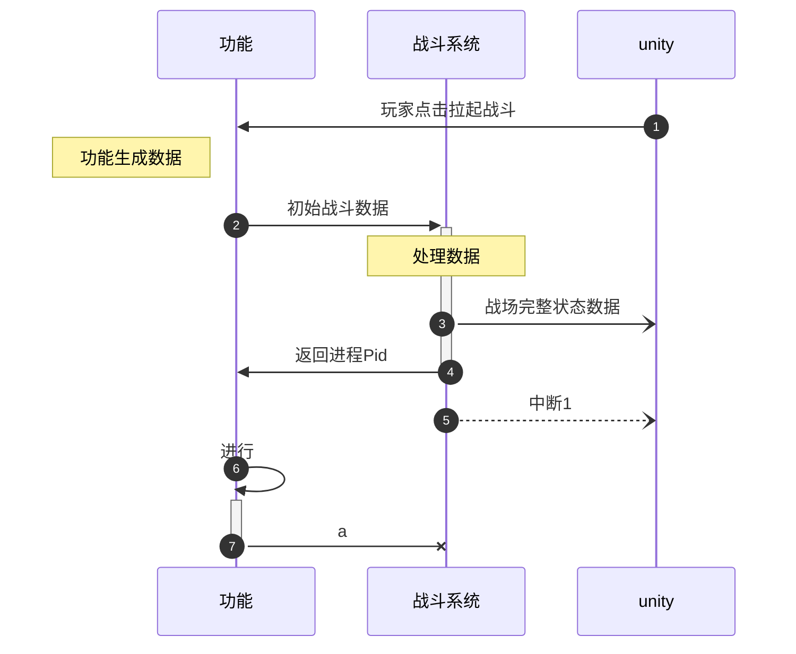

###### 战斗时序

```mermaid
sequenceDiagram
participant f as 功能
participant z as 战斗系统
participant u as unity
autonumber
u ->> f: 玩家点击拉起战斗
note left of f :功能生成数据

f->>+z: 初始战斗数据
note over  z:处理数据 
z-)u:战场完整状态数据
z->>-f: 返回进程Pid
z--)u:中断1

f->>+f:进行
f-x-z:a


```