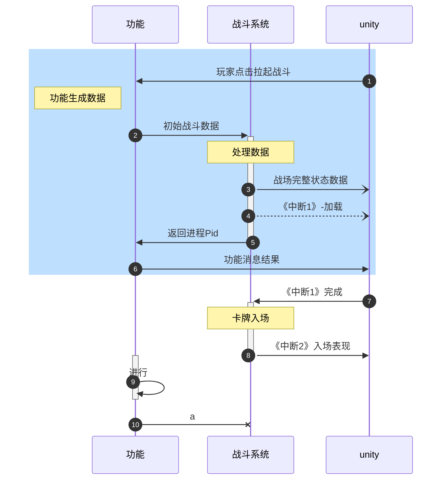

###### 战斗时序

```mermaid
sequenceDiagram
participant f as 功能
participant z as 战斗系统
participant u as unity
autonumber
rect rgb(191, 223, 255)
u ->> f: 玩家点击拉起战斗
note left of f :功能生成数据

f->>+z: 初始战斗数据
note over  z:处理数据 
z-)u:战场完整状态数据
z--)u:《中断1》-加载
z->>-f: 返回进程Pid
f->>u:功能消息结果
end
u->>+z:《中断1》完成
note over z:卡牌入场
z->>-u:《中断2》入场表现


activate  f
f->>-f:进行
f-xz:a


```