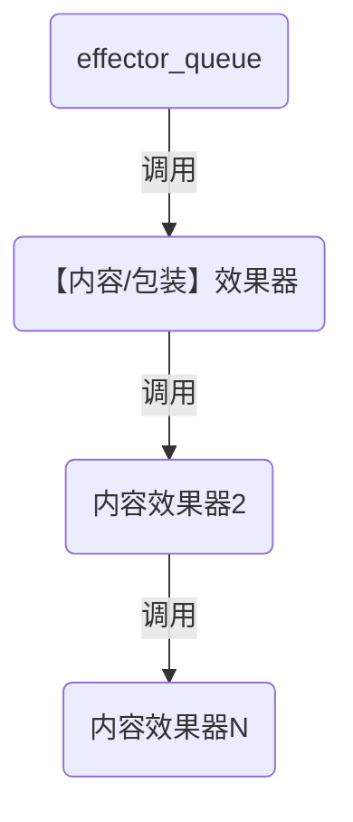

# web建站

#### 问题记录
如何等待**promise**执行完后再执行后续逻辑。比如有的api函数是返回的promise，但后续逻辑要等异步运行后的结果。

#### 网页加载完成时机

| 维度     |                `window.onload`                 |                   `$(document).ready()` |
| :------- | :--------------------------------------------: | --------------------------------------: |
| 执行时机 | 必须等网页全部载完毕（包括图片等），然后才执行 | 只需要等网页中的DOM结构加载完毕，就执行 |
| 执行次数 |       只能执行一次，重复执行会覆盖之前的       |                  可以执行多次，不会覆盖 |
| 简写方案 |                       无                       |                      `$(function(){});` |


# 开源协议的选择
[参考博文](http://www.ruanyifeng.com/blog/2011/05/how_to_choose_free_software_licenses.html "来源")


# git相关

#### git配置
```bash
#生成key
ssh-keygen -t ed25519 -C "Git my SSH Key"
#查看内容，上传到github
type C:\Users\xxx\.ssh\id_ed25519.pub

git@github.com:zheng-dev/zheng-dev.github.io.git
#配置上传看到的名称
git config --global user.name "xxx"
git config --global user.email xx@x.com

```

#### git同时向两个远端库上传
```editorconfig
[remote "gitee"]
	url = git@gitee.com:koo66/erlang_server.git
	fetch = +refs/heads/*:refs/remotes/gitee/*
	url = git@github.com:zzc16707826/my_all_test0.git
```
# 技能

