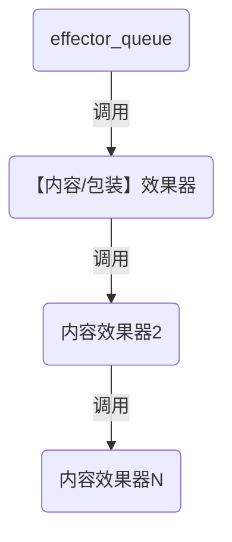

# web建站

#### 问题记录


#### *promise*的问题
测试代码如下20231208
```javascript
    //异步函数
    async function mer_html(code, num) {
      let promiseRet = mermaid.render('mermaid-svg-' + num++, code);
      let ret = await promiseRet.then(ret => {
        console.log("test1", ret.svg)
        return ret.svg;
      });
      console.log('test2', ret);
      return ret;
    }
    //同步函数
    function test(code, num) {
      let ret2;
      let a1 = mer_html(code, num).then(ret => ret2 = ret);
      console.log('test0', a1, ret2);
      console.log(333);
    }
```
下面的打印顺序是
1. `test0 Promise {<pending>} undefined`
2. 333
3. `test1 <svg ar...`
4. `test2 <svg ar...`

结论：
`async`函数返回的是*Promise*对象，`await`只能在`async`的函数体中。所以在同步函数体中不能等函数api的结论。只能用回调方式。如果在下面的场景下，就是不行的。如有这样一个调用链a调用b，b调用c。但a和c都是第3方提供的函数。如果b是非async的函数，而c是async的函数，但b需要c的返回结果处理逻辑。那就是不行的。

#### 网页加载完成时机

| 维度     |                `window.onload`                 |                   `$(document).ready()` |
| :------- | :--------------------------------------------: | --------------------------------------: |
| 执行时机 | 必须等网页全部载完毕（包括图片等），然后才执行 | 只需要等网页中的DOM结构加载完毕，就执行 |
| 执行次数 |       只能执行一次，重复执行会覆盖之前的       |                  可以执行多次，不会覆盖 |
| 简写方案 |                       无                       |                      `$(function(){});` |


# 开源协议的维度比较

| 修改源码后                           | LGPL许可证 | Mozilla许可证 | GPL许可证 | BSD许可证 | MIT许可证 | Apache许可证 |
| :----------------------------------- | :--------: | :-----------: | :-------: | :-------: | :-------: | -----------: |
| 可以闭源                             |     否     |      否       |    否     |    是     |    是     |           是 |
| 必须采用同样的许可                   |     否     |      否       |    是     |   未知    |   未知    |         未知 |
| 对修改处提供说明文档                 |     否     |      是       |   未知    |   未知    |   未知    |         未知 |
| 改动文件必须放置版权说明             |    未知    |     未知      |   未知    |    否     |    否     |           是 |
| 衍生软件的广告是否可以用你的名字促销 |    未知    |     未知      |   未知    |    否     |    是     |         未知 |

# git相关

#### git配置
```bash
#生成key
ssh-keygen -t ed25519 -C "Git my SSH Key"
#查看内容，上传到github
type C:\Users\xxx\.ssh\id_ed25519.pub

git@github.com:zheng-dev/zheng-dev.github.io.git
#配置上传看到的名称
git config --global user.name "xxx"
git config --global user.email xx@x.com

```

#### git同时向两个远端库上传
```editorconfig
[remote "gitee"]
	url = git@gitee.com:koo66/erlang_server.git
	fetch = +refs/heads/*:refs/remotes/gitee/*
	url = git@github.com:zzc16707826/my_all_test0.git
```
# 技能

